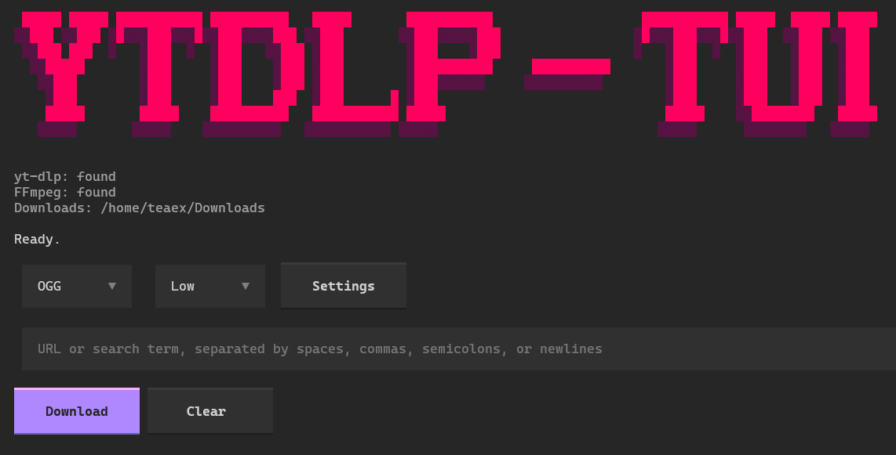

# ytdlp-tui

[](https://www.python.org/)
[](https://textual.textualize.io/)
[](./LICENSE)
[](https://github.com/Txaverria/ytdlp_tui/actions/workflows/release.yml)
[](https://github.com/Txaverria/ytdlp_tui/releases)



Cross-platform terminal UI for `yt-dlp`, built with Python and Textual.

`ytdlp-tui` is a fast, keyboard-friendly interface for downloading audio and video with `yt-dlp` without managing command flags manually. It provides a clean terminal workflow, live progress and logs, managed dependency installation on Windows, and simple settings for download location and runtime requirements like Deno.

## Table of Contents

- [Quick Install](#quick-install)
- [Features](#features)
- [Tech Stack](#tech-stack)
- [Installation](#installation)
- [Usage](#usage)
- [Build a Release](#build-a-release)
- [License](#license)

## Quick Install

Prebuilt releases are available on the [GitHub Releases](https://github.com/Txaverria/ytdlp_tui/releases) page.

On Windows PowerShell, you can run the installer script directly:

```powershell
irm https://raw.githubusercontent.com/Txaverria/ytdlp_tui/main/scripts/windows/install-ytdlp-tui.ps1 | iex
```

The installer downloads the latest Windows release, installs the app, and creates Start Menu shortcuts. It can install to:

- `Local AppData` (recommended)
- `Program Files`
- a custom folder
- the current folder

To uninstall on Windows:

- use the `Uninstall ytdlp-tui` shortcut from the Start Menu, or
- run the installed uninstaller directly:

```powershell
powershell -ExecutionPolicy Bypass -File "$env:LOCALAPPDATA\ytdlp-tui-installer\uninstall-ytdlp-tui.ps1"
```

## Features

- Clean TUI for video and audio downloads
- Multi-link input support
- Format presets: `mp3`, `m4a`, `ogg`, `mp4`, `webm`
- Quality presets: `high`, `medium`, `low`
- Live log output and progress states
- Managed `yt-dlp` install/update
- Windows-first managed `ffmpeg` install/update

## Tech Stack

- Python 3.11+
- Textual
- yt-dlp
- ffmpeg / ffprobe

## Installation

Prerequisites:

- Python 3.11 or newer
- On Linux/macOS, `yt-dlp` and `ffmpeg` are recommended on `PATH`
- On Windows, the app can install managed `yt-dlp` and `ffmpeg` for you
- For some YouTube downloads, `Deno` may also be required

If you only want the packaged Windows app, use the installer above or download the latest release instead of running from source.

Clone and run locally:

```bash
git clone https://github.com/Txaverria/ytdlp_tui.git
cd ytdlp-tui
python -m venv .venv
source .venv/bin/activate
python -m pip install -e .
python -m ytdlp_tui
```

On Windows PowerShell:

```powershell
git clone https://github.com/Txaverria/ytdlp_tui.git
cd ytdlp-tui
python -m venv .venv
.venv\Scripts\Activate.ps1
python -m pip install -e .
python -m ytdlp_tui
```

## YouTube Note

Some YouTube downloads may require [`Deno`](https://deno.com/) for JavaScript runtime support. If YouTube still blocks a request after Deno is installed, browser cookies may also be required.

On Windows PowerShell, Deno can be installed with:

```powershell
irm https://deno.land/install.ps1 | iex
```

## Usage

Download a single item:

```bash
python -m ytdlp_tui
```

Inside the app:

- paste one or more URLs into the input
- choose a format: `mp3`, `m4a`, `ogg`, `mp4`, `webm`
- choose a quality: `high`, `medium`, `low`
- press `Download`

Examples of accepted input:

```text
https://www.youtube.com/watch?v=example123
```

```text
https://www.youtube.com/watch?v=example123
https://www.youtube.com/watch?v=example456
```

```text
https://www.youtube.com/watch?v=example123, https://www.youtube.com/watch?v=example456
```

Expected behavior:

- live download progress in the status row
- live log output in the log panel
- automatic post-processing states such as converting, merging, or remuxing
- on Windows, missing `yt-dlp` or `ffmpeg` can be installed through the app

## Build a Release

```bash
python -m pip install .[build]
python scripts/package_release.py
```

Build output is written to `dist/`.

## License

MIT. See [`LICENSE`](./LICENSE).
